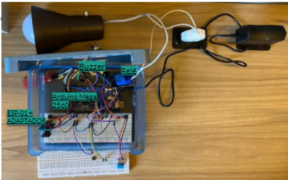

<h1 align="center">SEGURANÇA RESIDENCIAL ATRAVÉS DA DOMÓTICA</h1>
<h3 align="center">Instituto Federal de Educação, Ciência e Tecnologia de Santa Catarina</h3>
<h3 align="center">Campus Florianópolis</h3>
<h3 align="center">Departamento Acadêmico de Eletrônica</h3>
<h3 align="center">Projeto Integrador II</h3>
<h3 align="center">Thaine Martini</h3>


<p align="justfy">Resumo:  No momento atual (2021), é possível observar os cuidados que devemos ter em nossa casa para evitar acidentes domésticos. Hoje, com a tecnologia, existem equipamentos que auxiliam nessa tarefa, através de sensores é possível prever e até evitar alguns acidentes com os que envolvem vazamento de gás e acúmulo de  água. O projeto apresentado neste artigo é um protótipo que contém alguns itens para a segurança doméstica, através de um aplicativo é possível monitorar a umidade, temperatura e acender/desligar a luz do ambiente, mas ao ser detectado um vazamento de gás fica impossível de  alterar o estado da lâmpada, já no local que o projeto é instalado ao ser identificado gás e acúmulo de água é acionado um LED e um buzzer, fazendo com que quem esteja no ambiente fique ciente que existe uma adversidade. Um projeto simples, porém que pode salvar vidas.
 
Palavras-chave: Acidentes; Segurança; Sensores; Domótica; Automatização. 

<h3>INTRODUÇÃO</h3>

Em virtude dos avanços tecnológicos, a sociedade busca cada vez mais a comodidade no seu dia a dia. Na atualidade conseguimos pedir comida com apenas alguns cliques em um smartphone, ou até por um comando de voz; dirigir nunca foi tão fácil como nos tempos atuais, tudo isso graças a informática. O mundo está caminhando para tornar a vida cada vez mais inteligente, principalmente nas residências, essa tecnologia é chamada de domótica onde se monitora e controla os recursos habitacionais.

Segundo Bunemer (2014, p.10), “A Domótica Inteligente deve analisar os dados obtidos pelos sensores, de modo a adaptar suas regras de automação ao comportamento dos usuários do sistema automatizado. “ (BUNEMER, 2014), já que cada pessoa tem suas individualidades, como a sensibilidade para temperatura e luminosidade.

A domótica vem ganhando espaço no mercado Brasileiro, virou um utensílio de status ou até moda ter uma casa inteligente ou pelo menos alguns itens. TEZA (2002), alega que a automação Residencial promove mais comodidade e segurança.

Na automação residencial temos três níveis de interação, Sistemas Autônomos; Integração de Sistemas; Residência Inteligente. Sendo que a complexidade está diretamente ligada à experiência do usuário, quanto a interação do usuário com o sistema será necessária, ou seja, quanto menos o utilizador interagir com o sistema mais complexo ele será. (TEZA, 2002).

<p align="left"> Sistemas Autônomos - podemos ligar ou desligar um subsistema ou um dispositivo específico de acordo com um ajuste pré-definido. Porém, neste esquema, cada dispositivo ou subsistema é tratado independentemente, sem que dois dispositivos tenham relação um com o outro [...].Integração de Sistemas - é projetada para ter múltiplos subsistemas integrados a um único controlador. A limitação deste sistema está em que cada subsistema deve ainda funcionar unicamente na forma a qual o seu fabricante pretendia. Basicamente, trata-se apenas de controle remoto estendido a diferentes locais. [...] Residência Inteligente - o produto manufaturado pode ser personalizado para atender às necessidades do proprietário. O arquiteto, o Integrador de Sistemas e o proprietário delinearam instruções específicas para modificar o uso do produto. Assim, o sistema torna-se um GERENCIADOR, ao invés de apenas um controlador remoto.(TEZA, 2002, p. 31).</p>

A tendência é que a domótica cresça de acordo com a necessidade do ser humanos, quanto menos o usuário precisar interagir com sistema mais atrativo ele se torna.

<h3>CONCEPÇÃO</h3>

Com o avanço da tecnologia, podemos prever algumas coisa que antes não víamos necessidade, a ideia formulada é um sistema de segurança, onde ao haver um vazamento de gás é impossível acionar o interruptor, a lâmpada por sua vez pode ser acionada remotamente através de um aplicativo (Blynk), nesse aplicativo também é mostrado a temperatura e a umidade do ambiente, além disso o projeto informa sobre acúmulo de água no ambiente acionando um alerta, com o funcionamento igual mostra o fluxograma (Figura 1). Para o projeto é necessário, uma lâmpada, soquete, tomada, um ESP8266 para comunicação WIFI, um sensor de gás (MQ2), sensor de nível de água, sensor de temperatura e umidade (DHT11), buzzer, LED,  um arduino mega para programação, jumpers, protoboard e resistores. Para o acionamento remoto é utilizado o aplicativo Blynk, que possui uma interface fácil e intuitiva, além de aceitar o esp01.
	
Figura 1 - fluxograma de concepção do projeto.

Fonte: Arquivo pessoal


<h3>DESIGN</h3>
	
O design do projeto tem três partes: o código, o hardware e o aplicativo. Para o  código, foi utilizado o software e o kit do arduino para a programação do atmega, abaixo é possível visualizar detalhes da implementação do mesmo. 


``` c++
#define BLYNK_PRINT Serial

#include <ESP8266_Lib.h>
#include <BlynkSimpleShieldEsp8266.h>

#include <DHT.h>

#define entradaDigital 52
#define entradaAnalogica 0

char auth[] = "RqNjEhT0XaNgcMy-A9hqIwe5VnSWQO6f"; //código do app do Blynk

//para a conexão com a internet
char ssid[] = "MARTINI";      
char pass[] = "FSBTmartini";

float t; //variavel umidade
float h; //variavel temperatura

#define EspSerial Serial1

#define ESP8266_BAUD 115200

ESP8266 wifi(&EspSerial);

//sensor de humidade e temperatura
#define DHTPIN 2     
#define DHTTYPE DHT11    

DHT dht(DHTPIN, DHTTYPE);
BlynkTimer timer;

//buzzer
int buzzer = 6;

//sensor de agua
const int pinoSensor = A15; //PINO ANALÓGICO UTILIZADO PELO SENSOR
int pinoLED = 7; //PINO DIGITAL UTILIZADO PELO LED            
int waterVal;

//gas
bool dSensor;
int aSensor;

//rele
int pbuttonPin = 5;// connect output to push button
int relayPin = 10;// Connected to relay (LED)

int val = 0; // push value from pin 2
int lightON = 0;//light status
int pushed = 0;//push status

//TEMP/UMI
  void sendSensor(){
    float h = dht.readHumidity();
    float t = dht.readTemperature(); 
    
    Serial.println(" ");
    Serial.print("Temperatura atual: ");
    Serial.print(t);
    Serial.println("ºC");
  
    Serial.print("Umidade relativa do ar atual: ");
    Serial.print(h);
    Serial.println("%");
    Serial.println("");
  
    if (isnan(h) || isnan(t)) {
      Serial.println("Failed to read from DHT sensor!");
      return;
      }

      //mandar os dados de temperatura e umidade para o blynk
      Blynk.virtualWrite(V5,dht.readHumidity());
      Blynk.virtualWrite(V6, dht.readTemperature());
    }
  
void setup()
{
  
// Debug console
Serial.begin(9600);

// ESP8266 baud rate
EspSerial.begin(ESP8266_BAUD);
delay(10);

Blynk.begin(auth, wifi, ssid, pass);
dht.begin();
timer.setInterval(1000L, sendSensor);

//buzzer
 pinMode(buzzer,OUTPUT);

//AGUA
 pinMode(pinoSensor, INPUT);
 pinMode(pinoLED, OUTPUT); //DEFINE O PINO COMO SAÍDA

//relay
  Serial.begin(9600);
  pinMode(entradaDigital, INPUT);
  pinMode(pbuttonPin, INPUT_PULLUP); 
  pinMode(relayPin, OUTPUT);
  digitalWrite(relayPin, HIGH);//MANTEM DESLIGADO NO INICIO

void loop()
{
  Blynk.run();
  timer.run(); 

  if(dSensor == 1){
   digitalWrite(buzzer,HIGH);
   digitalWrite(pinoLED,LOW);
  }else{
    digitalWrite(buzzer,LOW); 
    digitalWrite(pinoLED,HIGH); 
    }
  
  dSensor = digitalRead(entradaDigital);
  aSensor = analogRead(entradaAnalogica);
  
  Serial.print("Leitura entrada digital: ");
  Serial.println(dSensor);
  
  Serial.print("Leitura entrada analógica: ");
  Serial.println(aSensor);
  Serial.println();
  

  //RELE
  val = digitalRead(pbuttonPin);

  if(val == HIGH && lightON == LOW){

    pushed = 1-pushed;
    delay(100);
  }    

  lightON = val;

      if((pushed == LOW && dSensor == 1)){
        Serial.println("Light ON");
        digitalWrite(relayPin, HIGH); 
       
      }else{
        Serial.println("Light OFF");
        digitalWrite(relayPin, LOW);
      }

  //AGUA
  waterVal = analogRead(pinoSensor); //read the water sensor    
  Serial.println("SENSOR DE AGUA");
  Serial.println(waterVal);
       
  if (waterVal >= 500){
     digitalWrite(pinoLED, HIGH);//if the water sensor senses water turn the led on
     digitalWrite(buzzer,LOW);
  }

  else{
    digitalWrite(pinoLED, LOW);//if it doesn't sense anything turn the led off
    digitalWrite(buzzer,HIGH);
  }
  
  delay(100);
}
```

O design do hardware foi feito no aplicativo fritzing, um hardware simples com tecnologias encontradas no mercado nacional.


Figura 2 - Design do Hardware 


Fonte: Arquivo Pessoal

Para o design do aplicativo foi utilizado o Blynk, que está presente na AppStore e na Google Play, nesse aplicativo é possível adicionar botões, displays, timer e outras utilidades. Nesse projeto foi utilizado um botão e dois displays, como mostra a figura 3.

Figura 3 - Design do aplicativo

Fonte: Arquivo Pessoal

<h3>IMPLEMENTAÇÃO </h3>

O projeto, feito para a disciplina de Projeto Integrador 2 da Engenharia Eletrônica do IFSC, foi desenvolvido através de componentes emprestados da instituição, ao recebê-los foi testado os sensores que foram utilizados no protótipo. Primeiramente foi escolhido trabalhar com ESP01 e de início foram apresentadas algumas dificuldades no código para a utilização do wifi, o esp não estava sendo identificado, após conversas no fórum da blynk descobri que era apenas a taxa de transmissão do esp que estava incorreta no código. Após corrigir a taxa de transmissão o componente funcionou perfeitamente.

Através de um código disponibilizado pela própria blynk, foi possível fazer a conexão arduino x aplicativo, e agregar os códigos dos outros componentes. 

O protótipo montado ficou como mostra a figura 4 e por dentro na Figura 5.

<p align="center">Figura 4 - Protótipo Finalizado (exterior)</p>
<p align="center"><br></p>
<p align="center">Fonte: Arquivo Pessoal</p>


<p align="center">Figura 5 - Protótipo Finalizado (interior)</p>
<p align="center"><br></p>
<p align="center">Fonte: Arquivo Pessoal</p>

Após alguns teste foi verificado um bug no botão de acionamento remoto, a lampada só muda de estado caso o botão esteja no off e mude para o on, porém isso não afeta significativamente o projeto.
	
<h3>OPERAÇÃO</h3>

O protótipo em operação pode ser visualizado no link:  
https://drive.google.com/file/d/1MQcfraQatCqzddx5zNOjeE70ASlFMEyu/view?usp=sharing 

<h3>MELHORIAS FUTURA</h3>
	
Caso o projeto seguisse em frente, algumas sugestões poderiam ser acrescentadas como: sistema de abertura de porta automático caso detectado vazamento de ar, um acionamento mecânico para a luz e correção de bugs. Além, é claro, de uma vedação no sistema.

<h3>CONCLUSÃO</h3>

O sistema tem uma boa performance e opera de modo simples, apesar de algumas complicações e de que o sistema precisa de algumas melhorias. O sistema desenvolvido gera conforto e deixa as residências mais seguras.
 
<h3>REFERÊNCIAS</h3>
	
TEZA, Vanderlei Rabelo. Alguns Aspectos Sobre  Automação Residencial - Domótica. Florianópolis, 2002. Disponivél em:
https://repositorio.ufsc.br/xmlui/bitstream/handle/123456789/83015/212312.pdf?sequence=1&isAllowed=y 

BUNEMER, Ricardo. Domótica Assistiva Utilizando Sistema de Supervisão e Controle. Campinas, 2014. Disponivél em: http://repositorio.unicamp.br/bitstream/REPOSIP/265887/1/Bunemer_Ricardo_M.pdf
	</p>
